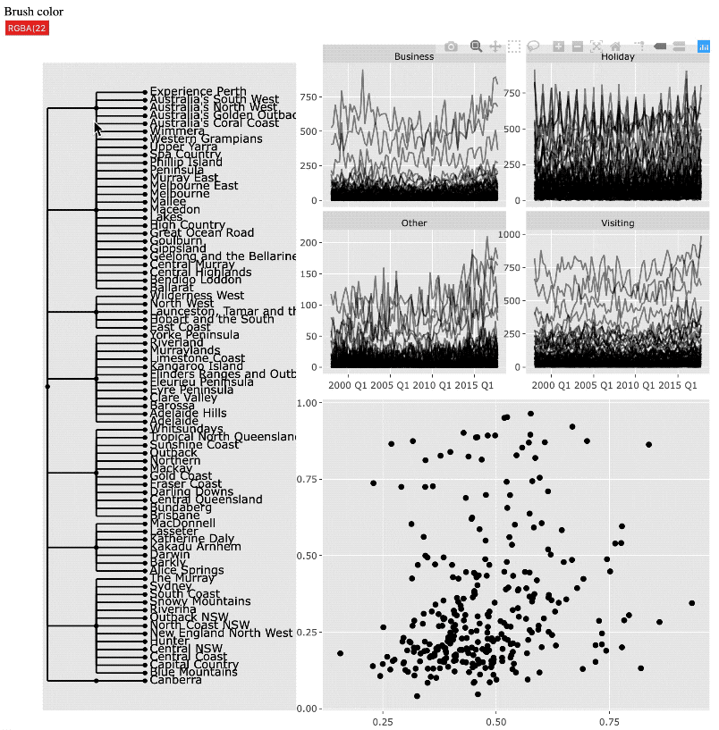
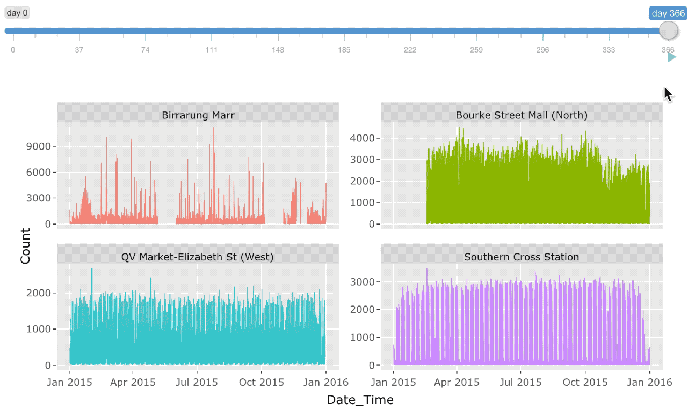

<!-- README.md is generated from README.Rmd. Please edit that file -->

# tsibbletalk

<!-- badges: start -->

[](https://github.com/earowang/tsibbletalk/actions)
<!-- badges: end -->

A *tsibble* consists of index, key, and other measured variables. The
key identifies series/panels of interests, which often remain the same
during the exploration loop. Understanding multi-faceted data requires
an ensemble of graphics, and linked brushing via `key` will accelerate
the exploratory data visualisation process. The {tsibbletalk} package
introduces shared `key` to the *tsibble*, to easily
[{crosstalk}](https://rstudio.github.io/crosstalk/) between plots on
both client and server sides (i.e. with or without shiny).

## Installation

You can install the development version of tsibbletalk from
[GitHub](https://github.com/) with:

``` r
# install.packages("remotes")
remotes::install_github("earowang/tsibbletalk")
```

## Get started

### Linking views via shared tsibble

The `as_shared_tsibble()` turns a tsibble object to a shared tsibble. If
there’s any nesting/hierarchical structure in the key variables, the
`spec` argument should be supplied for the structural specification. For
example, the structure in the `tourism` data contains the geographical
hierarchy, `State` nesting (`/`) lower-level `Region`s, and each
location crossed (`*`) with the trip `Purpose`. The `plotly_key_tree()`
visualises the tree structure specified in the `spec`, which is helpful
in navigating interested series for later.

``` r
library(tsibble)
library(tsibbletalk)
tourism_shared <- tourism %>%
  as_shared_tsibble(spec = (State / Region) * Purpose)
p0 <- plotly_key_tree(tourism_shared, height = 900, width = 600)
```

Multiple displays are constructed: (1) the overall tree plot in the left
panel, (2) the time series plot in the top right, and (3) the
scatterplot representing featured metrics for each series, produced by
the `features()`. All known functions here, but (yes) generate linking
views.

``` r
library(feasts)
tourism_feat <- tourism_shared %>%
  features(Trips, feat_stl)

library(ggplot2)
p1 <- tourism_shared %>%
  ggplot(aes(x = Quarter, y = Trips)) +
  geom_line(aes(group = Region), alpha = 0.5) +
  facet_wrap(~ Purpose, scales = "free_y")
p2 <- tourism_feat %>%
  ggplot(aes(x = trend_strength, y = seasonal_strength_year)) +
  geom_point(aes(group = Region))

library(plotly)
subplot(p0,
  subplot(
    ggplotly(p1, tooltip = "Region", width = 900),
    ggplotly(p2, tooltip = "Region", width = 900),
    nrows = 2),
  widths = c(.4, .6)) %>%
  highlight(dynamic = TRUE)
```



### Slicing and dicing on server-side

The `key` carries nested and crossed embedding, and the `index` provides
temporal information. Slicing and dicing time index can help to build
richer profiles for each series. A shiny module, a pair of UI and server
functions, is provided to interactively slice and dice a *tsibble*. This
allows to quickly locate an interesting slice in time.

``` r
p <- fill_gaps(pedestrian) %>%
  filter_index(~ "2015") %>% 
  ggplot(aes(x = Date_Time, y = Count, colour = Sensor)) +
  geom_line(size = .2) +
  facet_wrap(~ Sensor, scales = "free_y") +
  theme(legend.position = "none")

library(shiny)
ui <- fluidPage(tsibbleWrapUI("tswrap"))
server <- function(input, output, session) {
  tsibbleWrapServer("tswrap", p, period = "1 day")
}
shinyApp(ui, server)
```


